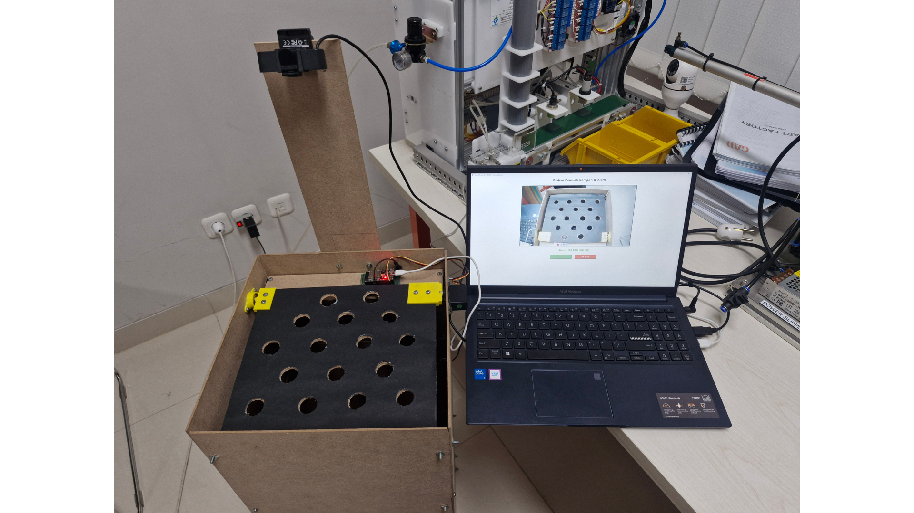
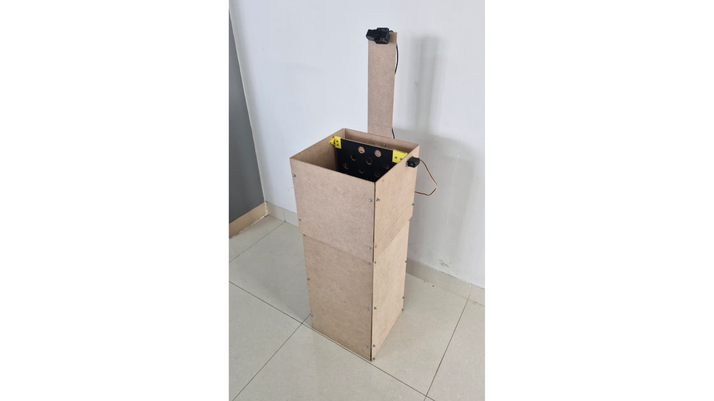
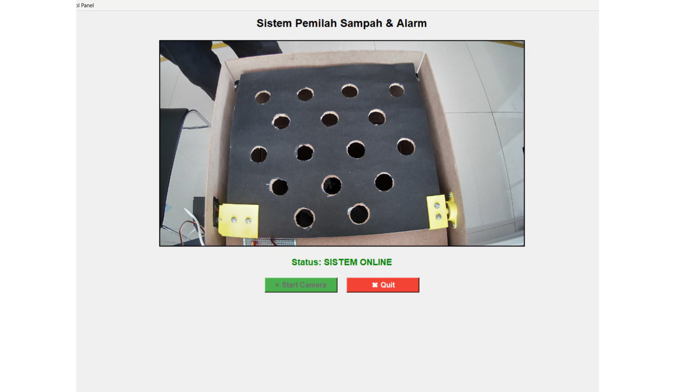

# Smart Trash Bin: Real-Time Plastic Bottle Detection & Automated Waste Sorting System

[](https://www.python.org/)
[](https://docs.ultralytics.com/models/rtdetr/)
[](https://www.intel.com/content/www/us/en/developer/tools/openvino-toolkit/overview.html)
[](https://www.espressif.com/en/products/socs/esp32)
[](#evaluation--benchmark-results)
[](#evaluation--benchmark-results)



> **Real-time plastic bottle detection and automated waste sorting using RT-DETR, OpenVINO, and ESP32.**

---

## 📌 Project Overview

Automated waste segregation at disposal points is essential for improving recycling efficiency and preventing cross-contamination in recyclable plastic streams. 

This repository contains the complete implementation of a cyber-physical smart waste bin prototype developed as an engineering thesis research project. The system integrates modern computer vision with embedded hardware actuation:
1. **Visual Stream Acquisition:** Captures live video feed from a camera.
2. **Real-Time Detection:** Employs an **RT-DETR-L** (Real-Time Detection Transformer Large) model optimized with **OpenVINO** for low-latency inference.
3. **Hardware Decision Dispatch:** Transmits detection commands over UART serial communication (`115200 baud`) to an **ESP32 microcontroller**.
4. **Physical Actuation:** Drives an SG90 servo motor mechanism to open the sorting valve for plastic bottles and triggers an active buzzer audio alert when non-bottle foreign objects are identified.

---

## 🚀 Key Features

* **Transformer-Based Object Detection:** Utilizes RT-DETR-L with an anchor-free and NMS-free dual-decoder architecture, avoiding traditional Non-Maximum Suppression postprocessing bottlenecks.
* **Edge-Optimized Inference:** Exported to OpenVINO Intermediate Representation (IR) format for fast execution on standard host computing hardware.
* **Cyber-Physical Actuation:** Direct serial interfacing between the Python AI application and an ESP32 microcontroller controlling physical servo and buzzer actuators.
* **Dual Operation Modes:** Provides an interactive Tkinter Desktop GUI with live video overlay as well as a headless CLI inference engine.
* **Integrated Diagnostics:** Includes standalone utilities for camera verification and baseline testing.

---

## 🏗️ System Pipeline & Architecture

The end-to-end dataflow connects visual perception, software decision logic, and physical actuation:

```text
Camera
   ↓
RT-DETR-L (OpenVINO IR, 640×640)
   ↓
Plastic Bottle / Random Detection
   ↓
Confidence Filtering
   ↓
Python Desktop GUI / Decision Logic
   ↓
UART Serial Communication (115200 baud)
   ↓
ESP32 Microcontroller
   ├── Servo Motor (GPIO 13) → Sorting Mechanism (Rotate 90°)
   └── Active Buzzer (GPIO 19) → Audio Alert (3x Beeps)
```

```text
       ┌────────────────────────┐
       │     Digital Camera     │
       │  (1280x720 in GUI App) │
       └───────────┬────────────┘
                   │ Video Frames
                   ▼
       ┌────────────────────────┐
       │      OpenVINO IR       │
       │ (RT-DETR-L 640x640 IR) │
       └───────────┬────────────┘
                   │ Class ID & Confidence
                   ▼
       ┌────────────────────────┐
       │ Python Decision Engine │
       │ (GUI / CLI Controller) │
       └───────────┬────────────┘
                   │ Serial Command (UART @ 115200 baud)
                   ▼
       ┌────────────────────────┐
       │  ESP32 Microcontroller │
       │   (CodeArduinoIDE)     │
       └─────┬────────────┬─────┘
             │            │
             │ Signal '1' │ Signal '2'
             ▼            ▼
   ┌────────────────┐   ┌───────────────────────┐
   │ Servo Motor    │   │ Active Buzzer         │
   │ (GPIO 13)      │   │ (GPIO 19)             │
   │ Rotate 90°     │   │ 3x Alert Beep Pattern │
   └────────────────┘   └───────────────────────┘
```

---

## 📷 System Visuals

### Physical Prototype

*The physical smart trash bin prototype integrating the camera mount, enclosure structure, sorting flap mechanism, and embedded electronic housing.*

### Application Interface

*The Main Desktop GUI control panel featuring live video rendering, real-time bounding box visualization, system status indicators, and operational controls.*

---

## 📊 Dataset & Model Configuration

* **Dataset Identifier:** `SampahPlastik-2` (Roboflow `data.yaml`)
* **Classes (2 Classes):**
  * `0: Botol Plastik` (Target plastic bottles)
  * `1: Random` (Foreign objects / non-bottle waste / background items)
* **Training Resolution:** 640 × 640 pixels
* **Validation Set:** 33 images (484 annotated instances: 288 `Botol Plastik`, 196 `Random`)

---

## ⚙️ Model Architecture & Training Parameters

The object detection model was trained using Google Colab as documented in [`notebooks/SkripsiRTDETR1.ipynb`](notebooks/SkripsiRTDETR1.ipynb):

* **Architecture:** Baidu / Ultralytics RT-DETR Large (`rtdetr-l.pt`)
* **Model Complexity:** 310 layers, 31,987,850 parameters, 103.4 GFLOPs
* **Training Hardware:** NVIDIA Tesla T4 (14,913 MiB VRAM), CUDA 13.0, PyTorch 2.10.0+cu128
* **Epochs:** 50 completed epochs (0.932 training hours)
* **Batch Size:** 16
* **Input Image Size:** 640 × 640 pixels
* **Optimizer:** AdamW (actual learning rate: `0.001667`, momentum: `0.9`)
* **Export Target:** OpenVINO IR (`best.xml`, `best.bin`, `metadata.yaml`)

---

## 📈 Evaluation & Benchmark Results

### 1. Quantitative Performance Metrics (Validated from `best.pt`)

The final checkpoint `best.pt` was validated after the 50-epoch training run. Performance metrics across the Validation Set are summarized below:

| Metric | Overall (`all`) | Class: `Botol Plastik` | Class: `Random` |
|---|:---:|:---:|:---:|
| **Precision (Box P)** | **94.9%** | 91.5% | 98.4% |
| **Recall (Box R)** | **94.6%** | 95.8% | 93.4% |
| **mAP @ 0.5** | **97.4%** | 96.7% | 98.2% |
| **mAP @ 0.5:0.95** | **81.2%** | 82.1% | 80.3% |

> [!NOTE]
> The performance metrics above reflect the subsequent evaluation of the optimal checkpoint (`best.pt`) on the validation set, ensuring an accurate and rigorous assessment beyond intermediate training-epoch outputs.

### 2. Inference Speed & Throughput
* **Preprocessing:** 0.2 ms per image
* **Inference Latency:** 22.8 ms per image (evaluated on NVIDIA Tesla T4)
* **Postprocessing:** 1.7 ms per image
* **Estimated Model Throughput:** ~43.8 FPS (derived mathematically as `1000 / 22.8 ms` for the GPU inference stage alone).

> [!NOTE]
> The 22.8 ms metric reflects the standalone model inference-stage latency on GPU hardware. Total end-to-end system response in real-world deployment also includes video frame acquisition, display rendering, serial communication transit, and physical mechanical actuation.

---

## 🔬 Script Configuration & Operational Modes

The codebase provides modular scripts designed for specific testing, calibration, and deployment scenarios. Operational settings differ based on script design:

| Script File | Execution Mode | Inference Engine | Confidence Threshold | Confirmation Delay / Debounce |
|---|---|---|:---:|:---:|
| [`src/Uji_TerakhirBuzzer.py`](src/Uji_TerakhirBuzzer.py) | Main Desktop GUI (Tkinter) | OpenVINO (`best_openvino_model`) | `conf = 0.90` | `5 seconds` (Configurable confirmation duration) |
| [`src/uji_integrasi_igpu.py`](src/uji_integrasi_igpu.py) | Headless / CLI | OpenVINO (`best_openvino_model`) | `conf = 0.60` | `5 seconds` (Debounce confirmation window) |
| [`experiments/Uji_Terakhir.py`](experiments/Uji_Terakhir.py) | Desktop GUI (Tkinter) | OpenVINO (`best_openvino_model`) | `conf = 0.90` | `5 seconds` (Timed confirmation mode) |
| [`src/uji_kamera.py`](src/uji_kamera.py) | Standalone Video Test | PyTorch (`best.pt`) | `conf = 0.60` | None (Camera feed diagnostic) |

The system is designed with a 5-second detection confirmation window before an actuator command is triggered. This duration is configurable through the `durasi_konfirmasi` parameter in `src/Uji_TerakhirBuzzer.py`.

---

## 🔌 Hardware Control & Pinout

Firmware logic is implemented in [`firmware/CodeArduinoIDE_ForESP32/CodeArduinoIDE_ForESP32.ino`](firmware/CodeArduinoIDE_ForESP32/CodeArduinoIDE_ForESP32.ino):

* **Microcontroller:** ESP32 Development Board
* **Baud Rate:** `115200 baud` (Serial UART)
* **Servo Actuator:**
  * **Pin:** `GPIO 13` (`pinServo`)
  * **Mode in Code:** `MODE SG90 PRESISI`
  * **Initial Position:** 180°
  * **Behavior:** When serial command `'1'` is received, moves to 90°, holds for 3000 ms, then returns to 180°.
* **Active Buzzer:**
  * **Pin:** `GPIO 19` (`pinBuzzer`)
  * **Type:** Active Buzzer (driven by `digitalWrite` HIGH/LOW)
  * **Startup Sound:** Emits a single startup confirmation beep for 800 ms.
  * **Behavior:** When serial command `'2'` is received, pulses 3 alert beeps (200 ms ON, 200 ms OFF).

---

## 📁 Repository Structure

```text
assets/
  physical-prototype.png
  smart-trash-bin.png
  user-interface.png

experiments/
  Uji_Terakhir.py
  uji_integrasi.py
  uji_integrasi_buzzer.py

firmware/
  CodeArduinoIDE_ForESP32/
    CodeArduinoIDE_ForESP32.ino

notebooks/
  SkripsiRTDETR1.ipynb

src/
  Uji_TerakhirBuzzer.py
  uji_integrasi_igpu.py
  uji_kamera.py

weights/
  README.md
  metadata.yaml

.gitignore
README.md
requirements.txt
```

---

## 📦 Model Weights

Due to Git file size limitations, large model binary files are excluded from version control:
* PyTorch training weights (`best.pt`, ~66.2 MB)
* OpenVINO binary weights (`best_openvino_model/best.bin`, ~127.9 MB)

Refer to [`weights/README.md`](weights/README.md) for instructions on where to obtain model weights and how to place them into the workspace. The model configuration file [`weights/metadata.yaml`](weights/metadata.yaml) is tracked directly in the repository to define input resolution and class label mappings.

---

## 🚀 Getting Started

### 1. Clone Repository & Setup Environment
```bash
# Clone the repository
git clone https://github.com/dmascp/smart-trash-bin-based-on-RTDETR-model-for-bottle-plastic.git
cd smart-trash-bin-based-on-RTDETR-model-for-bottle-plastic

# Create and activate virtual environment
python -m venv venv
venv\Scripts\activate      # On Windows
# source venv/bin/activate  # On Linux/macOS

# Install required dependencies
pip install -r requirements.txt
```

### 2. Prepare Model Weights
Ensure model weights (`best.pt` or the extracted `best_openvino_model/` directory) are placed in the project root or inside `weights/` as documented in [`weights/README.md`](weights/README.md).

### 3. Flash ESP32 Firmware
1. Connect the ESP32 board to your computer via USB.
2. Open [`firmware/CodeArduinoIDE_ForESP32/CodeArduinoIDE_ForESP32.ino`](firmware/CodeArduinoIDE_ForESP32/CodeArduinoIDE_ForESP32.ino) in the Arduino IDE.
3. Install the required `ESP32Servo` library via Arduino Library Manager.
4. Select the appropriate ESP32 board and COM port, then click **Upload**.

### 4. Run the Application
To run the Main Desktop GUI control panel:
```bash
python src/Uji_TerakhirBuzzer.py
```

To run the headless OpenVINO CLI inference engine:
```bash
python src/uji_integrasi_igpu.py
```

To test the camera feed:
```bash
python src/uji_kamera.py
```

---

## 🛠️ Technologies Used

* **Deep Learning & Computer Vision:** Ultralytics RT-DETR-L, PyTorch
* **Model Optimization & Inference:** OpenVINO Toolkit
* **Image Processing & User Interface:** OpenCV (cv2), Pillow (PIL), Tkinter
* **Embedded Hardware & Serial Communication:** ESP32 DevKit, Arduino C++, ESP32Servo, PySerial
* **Data Handling & Evaluation:** Roboflow, Pandas, Matplotlib, Seaborn

---

## 🎯 Project Scope & Context

This project represents an integrated research implementation combining deep learning perception with low-cost embedded actuation. The repository focuses on reproducibility of the software architecture, microcontroller firmware, and evaluation workflows. High-capacity weight binaries and raw dataset archives are managed outside Git version control to ensure efficient repository maintenance.

---

## 👨‍💻 Author & Academic Affiliation

* **Author:** Demas Chandra Permana
* **Program:** Pendidikan Teknik Otomasi Industri dan Robotika (PTOIR)
* **Faculty:** Fakultas Pendidikan Teknologi dan Kejuruan (FPTK)
* **Institution:** Universitas Pendidikan Indonesia (UPI), Bandung, Indonesia
* **Advisor:** Dr. Erik Haritman, S.Pd., M.T.